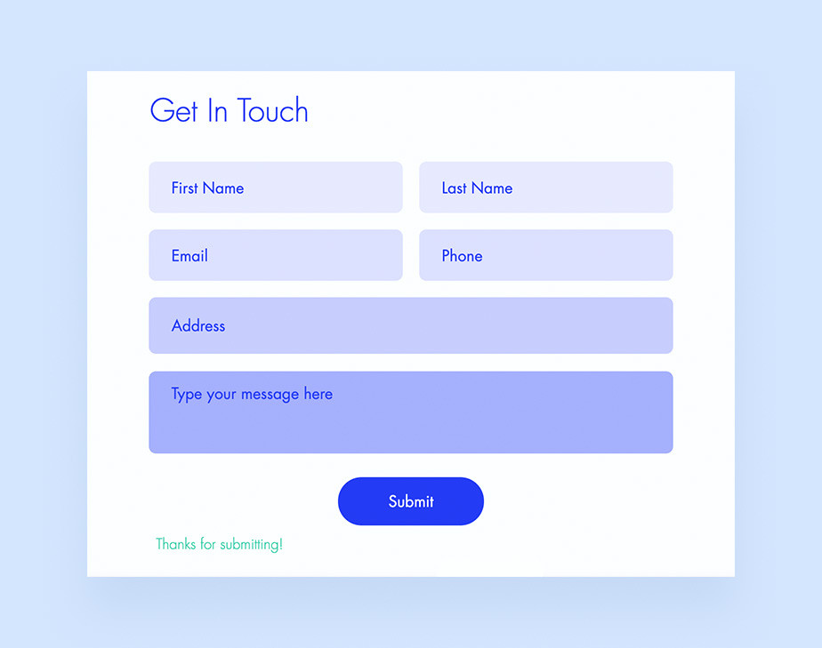

# Practical task Nr.3

_35 group website practical task_

This project is for **educational** purposes only. Pull request are welcome, but priority for project authors! Thank you for your cooperation!

Site published at: https://kristle22.github.io/praktine-uzduotis-3/

Design: 

## Project features

- Github pages (multi-page)
- HTML form
- CSS linear gradients
- CSS box-shadow
- CSS transform & transition effects

## Authors

Kristina: [Github](https://github.com/Kristle22)
